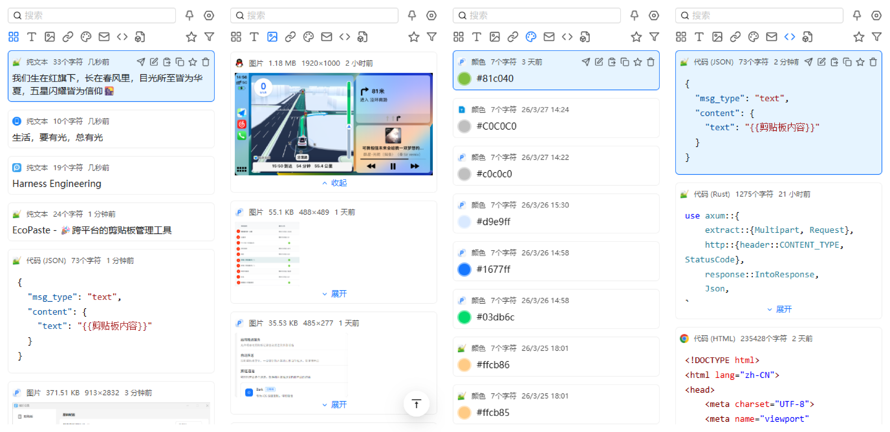

   

  

      English | <a href="./README.md">简体中文</a> | <a href="./README.zh-TW.md">繁體中文</a> | <a href="./README.ja-JP.md">日本語</a>
  

   
    
  

    <a href="https://github.com/3899/EcoPaste-Pro/releases">
      
    </a >
    <a href="./LICENSE">
      
    </a >
    <a href="https://github.com/3899/EcoPaste-Pro/releases">
      
    </a >
    <a href="https://github.com/3899/EcoPaste-Pro/releases">
        
    </a >
  

# EcoPaste-Pro - Intelligent Clipboard Management Hub Tailored for Windows

> **🌟 Branch Information**: This repository is an enhanced Fork of [EcoPasteHub/EcoPaste](https://github.com/EcoPasteHub/EcoPaste). Tailored specifically for the **Windows** platform, it restructures and introduces cross-device data synchronization, WebDAV secure cloud backup, panoramic storage statistics, and a 12-type intelligent content categorization engine with an immersive user experience.

EcoPaste-Pro is built with **Tauri v2** and **React 18**, deeply integrated with Win32 native capabilities, offering minimal memory footprint, instant hotkey activation, and native desktop integration. Featuring 100% local data storage and Windows Credential Manager hardware-level encryption.

---

## 📖 Documentation Navigation

* 🚀 **[Installation & Configuration Guide](./docs/install.md)**: Windows installation, seamless Win+V takeover, middle-click control, and shortcut recommendations.
* 📜 **[Version Changelog](./docs/changelog.md)**: Detailed historical changelog from Pro.5.x to M01.x, feature releases, and bug fix logs.
* ⚙️ **[Runtime & Data Storage](./docs/environment.md)**: Windows runtime requirements, SQLite database architecture, Windows Credential Manager security, and auto-vacuum maintenance.
* 🛠️ **[Developer Guide](./docs/developer.md)**: Tauri v2 + React 18 project architecture, local build instructions, and Win32 Rust plugin deep dive.
* 🔄 **[Data Sync & Mobile Interoperability](./docs/sync.md)**: Local HTTP receive API specification, Webhook dispatch, anti-loopback algorithm, and Android Tasker integration.

---

## ✨ Core Feature Highlights

| Feature Area | Key Capabilities |
| :--- | :--- |
| 📋 **Intelligent Classification Matrix** | 12 content types (Plain Text, Rich Text, HTML, Image, File, Markdown, Link, Path, Code, Email, Color, Command). 4D detection engine for office table composites, SVG parser, syntax highlighting, and CMYK/RGB color extraction. |
| 🖥️ **Dual Layout & Immersive Flow** | Classic top bar & new sidebar navigation. **Windows No-Focus Silent Paste Mode** (non-disruptive, double-click to paste). **Mouse Middle Click Global Toggle**, **Modifier Key Double-Tap Wakeup**, and **Seamless Win+V Takeover**. |
| 📊 **Panoramic Storage Manager** | Multi-dimensional dashboard analyzing 12 data types. Square-root smoothing algorithm for long-tail balance. Smart timeline filtering, batch cleanup with **deep local image file deletion**, and automatic SQLite VACUUM. |
| ☁️ **WebDAV Cloud Asset Backup** | Full and lite backup separation. Automated scheduling engine supporting **Scheduled time, Interval, and Cron expressions**. Credential encryption backed by Windows Credential Manager (DPAPI). |
| 📱 **Cross-Device Sync & Automation** | Built-in local HTTP server (`POST /api/write`). Supports writing to PC clipboard via mobile automation (Tasker / Shortcuts). Equipped with **Anti-Loopback fingerprint protection** and 5 image transfer strategies. |
| 🔒 **Local Privacy & Robustness** | Strict local-first architecture with zero telemetry or tracking probes. Single-Source-of-Truth database model providing robust backwards compatibility. |

---

## 🖼️ Interface Preview

  <h4>Main Clipboard Window (Sidebar Navigation & Category Filtering)</h4>
  
    

  <h4>Preferences - Clipboard & Window Settings</h4>
  
    

  <h4>Storage Statistics - Multi-Dimensional Analysis & Timeline</h4>
  
    

  <h4>Preferences - Shortcut Recording & Middle Click Control</h4>
  
    

  <h4>Data Backup - WebDAV Cloud Backup & Scheduling</h4>
  
    

  <h4>Data Sync - Local Receiver & Webhook Dispatch</h4>
  

---

## 📥 Downloads & Getting Started

### 🔗 This Fork
- 🚀 **Latest Release Download**: [Download Latest Windows Build from GitHub Releases](https://github.com/3899/EcoPaste-Pro/releases/latest)
- 📖 **Documentation**:
  - [Windows Installation & Configuration Guide](./docs/install.md)
  - [Android Tasker Sync Guide](./docs/Android/README.md)

### 🔗 Upstream Project
- 🌐 GitHub: [EcoPasteHub/EcoPaste](https://github.com/EcoPasteHub/EcoPaste)
- 📥 Releases: [EcoPaste Releases](https://github.com/EcoPasteHub/EcoPaste/releases)
- 📚 Website: [EcoPaste Official Site](https://ecopaste.cn/)

---

## 🤝 Community & Issue Feedback

1. 🔍 **Troubleshooting**: Check the [Installation Guide](./docs/install.md) or browse existing [Issues](https://github.com/3899/EcoPaste-Pro/issues).
2. ❓ **Report Issues**: If you encounter bugs or have feature suggestions, feel free to [Submit an Issue](https://github.com/3899/EcoPaste-Pro/issues/new/choose) with your Windows version (10/11), reproduction steps, and logs.

---

## 📄 License & Acknowledgments

- Licensed under [GPL-3.0 License](./LICENSE).
- Special thanks to the upstream core project [EcoPasteHub/EcoPaste](https://github.com/EcoPasteHub/EcoPaste) for the foundation.
- Ideas for "independent groups", "immersive editing", "code highlighting", and "source app extraction" were inspired by [EcoPaste-Sync](https://github.com/Ruszero01/EcoPaste-Sync).
